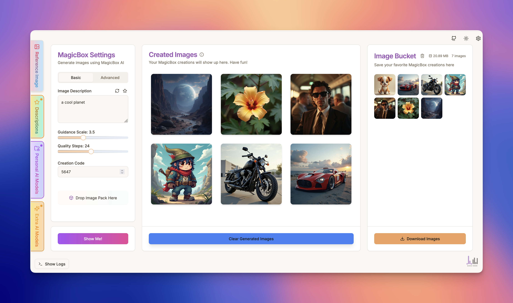
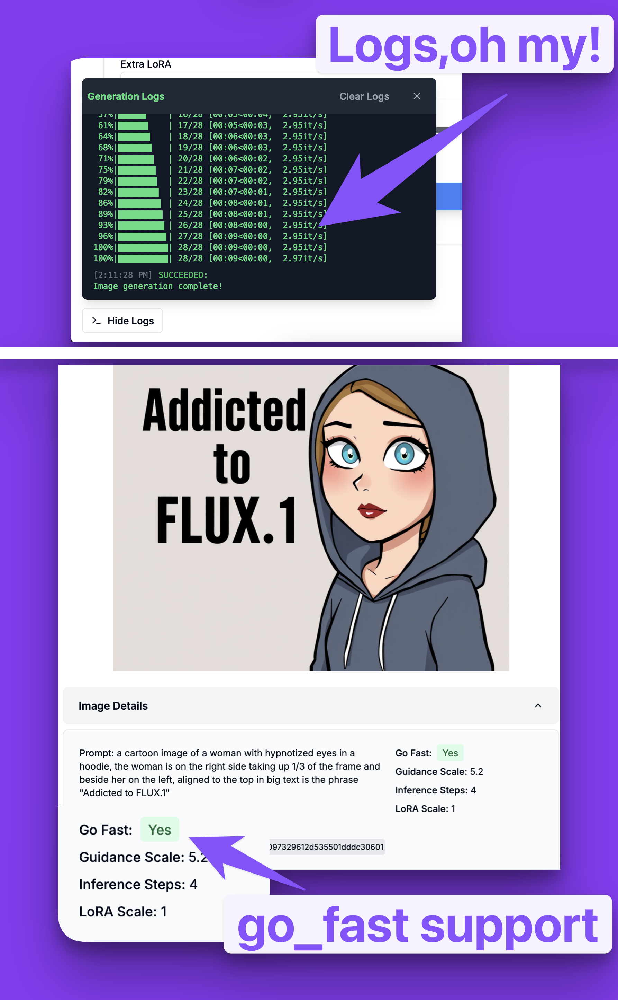

# MagicBox Studio

MagicBox Studio is a powerful AI image generation interface that makes it easy to create, edit, and iterate AI-generated image creations. Built with Next.js, it provides an intuitive workspace for working with multiple AI models, including FLUX.1 (Dev, Pro, Pro-Ultra, and Schnell versions) and ReCraft v3, all powered by Replicate's API.





## 🎨 Features

### Image Generation
- Multiple AI models optimized for different needs:
  - FLUX.1 Dev: Balanced quality and speed
  - FLUX.1 Pro: Maximum quality
  - FLUX.1 Pro Ultra: Enhanced detail
  - FLUX.1 Schnell: Rapid prototyping
  - ReCraft v3: Specialized art styles with SVG support
- Text-to-image generation with advanced prompt controls
- Image-to-image transformation capabilities
- Inpainting for selective image editing
- Support for LoRA models to achieve specific styles

### Workspace Features
- Image Bucket for organizing and managing generations
- Image Packs for saving and sharing complete generation settings
- Gallery view with detailed metadata
- Batch operations for efficient workflow
- Local storage for settings and favorites

### Technical Features
- Secure API key handling (stored in browser's local storage)
- Comprehensive quality controls
- Multiple output formats (PNG, JPEG, WebP, SVG)
- Flexible resolution options
- Advanced parameter controls

## 📚 Documentation

Comprehensive documentation is available in our [GitBook](https://magicbox-ai.gitbook.io/magicbox-ai/) covering:
- Getting Started guides
- Feature documentation
- Advanced tutorials
- Best practices
- Troubleshooting

## 🚀 Installation

1. Clone the repository:
   ```bash
   git clone https://github.com/ashakoen/magicboxstudio.git
   cd magicboxstudio
   ```

2. Install dependencies:
   ```bash
   npm install
   ```

3. Start the development server:
   ```bash
   npm run dev
   ```

## 💻 Usage

1. Visit `http://localhost:3000` (development) or your deployed URL
2. Enter your Replicate API key in Settings
3. Choose a model based on your needs:
   - FLUX.1 Dev for general use
   - FLUX.1 Schnell for quick tests
   - FLUX.1 Pro for highest quality
   - ReCraft v3 for specific art styles
4. Configure generation settings
5. Generate images using text prompts or existing images
6. Organize your work using the Image Bucket
7. Save and share settings with Image Packs

## 🔒 Security

- API keys are stored securely in browser local storage
- No backend storage of sensitive information
- Direct API communication with Replicate
- HTTPS required for production use

## 📁 Project Structure

```
.
├── src/
│   ├── app/              # Next.js app router
│   ├── components/       # React components
│   │   ├── cards/       # Main interface cards
│   │   ├── inspiration/ # Inspiration features
│   │   ├── modals/     # Modal components
│   │   └── ui/         # Base UI components
│   ├── hooks/           # Custom React hooks
│   ├── lib/             # Utility functions
│   ├── services/        # External services
│   └── types/           # TypeScript types
├── public/              # Static assets
├── docs/               # Documentation
└── [Configuration files]
```

## ⚙️ Configuration

### Frontend Configuration
- `next.config.mjs`: Next.js settings
- `tailwind.config.ts`: Styling configuration
- `tsconfig.json`: TypeScript settings

### Key Technologies
- Next.js 14
- React
- Tailwind CSS
- Radix UI Components
- TypeScript

## 🤝 Contributing

Contributions are welcome! Please:
1. Fork the repository
2. Create a feature branch
3. Submit a pull request

## 📄 License

This project is licensed under the MIT License. See the LICENSE file for details.

## 📬 Contact

For questions, suggestions, or issues:
- Open a GitHub issue
